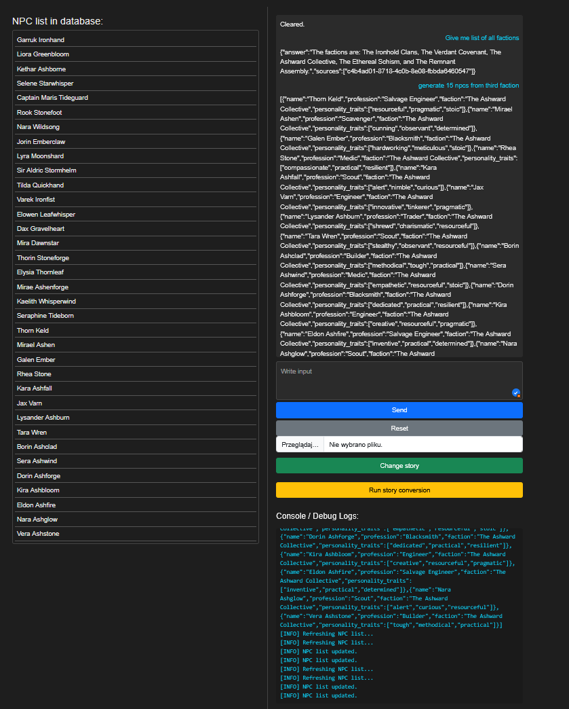
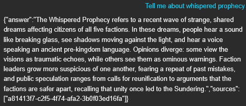
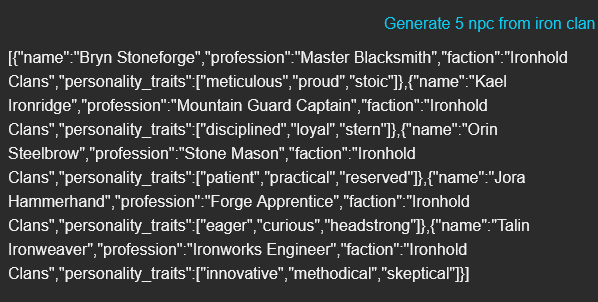
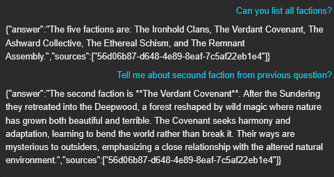
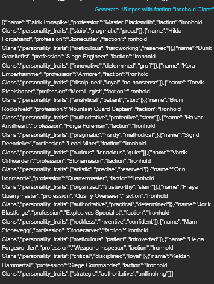
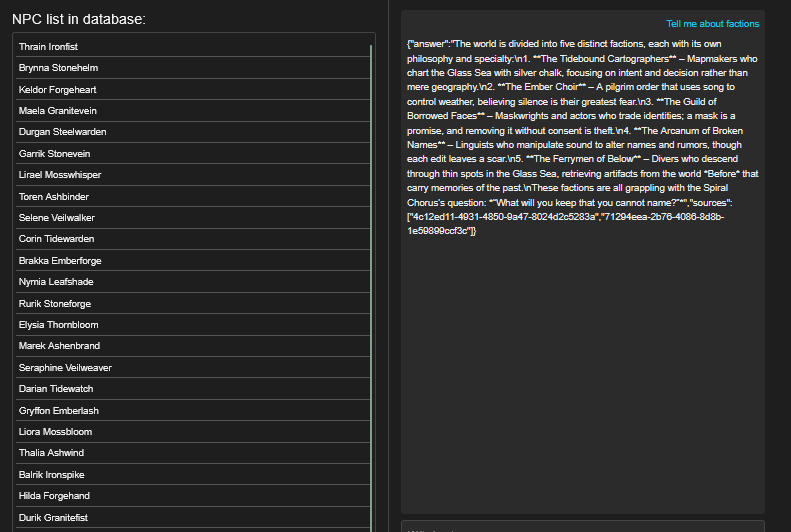

# NPC Generation System

System czatbota z interfejsem API, który odpowiada na pytania kontekstowe z podanej historii i generuje unikalne postacie NPC. Kontekst pozyskuje przez RAG (FAISS jako wektorowy magazyn), odpowiedzi tworzy LLM via Groq, a dane i sesje przechowuje w MongoDB.
---

## Spis treści

- [Wymagania](#wymagania)
- [Opis architektury](#opis-architektury)
- [Konfiguracja](#konfiguracja)
- [Uruchomienie lokalne](#uruchomienie-lokalne)
- [Uruchomienie w Docker](#uruchomienie-w-docker)
- [Endpoints API](#endpoints-api)
- [Przykłady użycia](#przykłady-użycia)
- [Moduły i funkcjonalności](#moduły-i-funkcjonalności)
- [Uwagi](#uwagi)
- [Rozwój i testowanie](#rozwój-i-testowanie)

---

## Wymagania

- Python >= 3.11
- MongoDB >= 7
- Docker (opcjonalnie)
- `.env` z kluczami i konfiguracją API Groq
- Upewnij się, że porty 8000 (aplikacja) i 27017 (MongoDB) są wolne

---

## Opis architektury

Aplikacja składa się z kilku modułów:

1. **FAISS RAG Store** – przechowuje fragmenty historii w indeksie FAISS i umożliwia szybkie wyszukiwanie kontekstu.
2. **NPC Pipeline** – generuje postacie NPC na podstawie podanego promptu, dba o unikalność imion i waliduje dane.
3. **QA Pipeline** – odpowiada na pytania w oparciu o kontekst FAISS i zapisane informacje.
4. **General Pipeline** – router, który klasyfikuje zapytanie (NPC lub QA) i deleguje je do odpowiedniego pipeline.
5. **ContextCache** – pamięć podręczna ostatnich pytań i odpowiedzi z mechanizmem podsumowania.
6. **MongoDB** – baza danych do przechowywania wygenerowanych NPC i sesji czatu.
7. **Testy jednostkowe** – weryfikują endpointy FastAPI oraz funkcjonalności pipeline'ów.

---

## Konfiguracja

1. Skopiuj plik `.env.example` do `.env` ( .env musi byc w App ( sciezka App/.env)):

```bash
cp .env.example .env
```

2. Uzupełnij zmienne środowiskowe w `.env`:

```env.example

APP_ENV=local
API_HOST=0.0.0.0
API_PORT=8000


GROQ_API_KEY= Klucz api
GROQ_BASE_URL=https://api.groq.com
GROQ_MODEL=openai/gpt-oss-20b


MONGO_URI=mongodb://mongo:27017/npcdb 
MONGO_DB=npcdb


FAISS_PATH=App/Data/index.faiss
FAISS_META_PATH=App/Data/index.faiss.meta.jsonl
```
---

## Uruchomienie lokalne

1. Zainstaluj zależności:

Przejdz do folderu /Foregamer_task
```bash
pip install -r requirements.txt
```

2. Uruchom MongoDB lokalnie (jeśli nie korzystasz z Dockera) lub pobierz mongocompass / baza chmurowa atlas(zmiana url wymagana w .env):

Przykładowe uruchomienie mongod: 
```bash 
mongod --dbpath ./data/db
```

3. Uruchom aplikację FastAPI:

```bash
uvicorn App.main:app --reload
```

Aplikacja będzie dostępna pod: `http://127.0.0.1:8000`

---

## Uruchomienie w Docker

### Z Dockerfile
W katalogu gdzie masz docker-compose.yaml odpal:
```bash
docker compose build 
```
Następnie po zbuildowaniu obrazu

```bash
docker compose up
```
Aby wejsc do aplikacji:  http://localhost:8000 lub http://127.0.0.1:8000
trzeba chwile poczekać aby zaczeło działać

# Jesli chcesz wylaczyc kontener:
docker compose down

Plik docker-compose.yaml
```yaml
services:
  api:
    build:
      context: .
      dockerfile: Dockerfile
    container_name: Npc_generation_system
    env_file:
      - ./App/.env
    ports:
      - "8000:8000"
    volumes:
      - ./App:/app/App
      - ./App/Data:/app/App/Data
    depends_on:
      - mongo
    command: uvicorn App.main:app --host 0.0.0.0 --port 8000 --reload

  mongo:
    image: mongo:6.0
    container_name: mongo_instance
    restart: unless-stopped
    environment:
      MONGO_INITDB_DATABASE: ${MONGO_DB:-npcdb}
    ports:
      - "27017:27017"
    volumes:
      - mongo_data:/data/db
    healthcheck:
      test: ["CMD", "mongosh", "--quiet", "--eval", "db.adminCommand('ping').ok"]
      interval: 5s
      timeout: 3s
      retries: 10

volumes:
  mongo_data: {}
```


Plik dockerfile
``` dockerfile

FROM python:3.11-slim


RUN apt-get update && apt-get install -y --no-install-recommends \
    libgomp1 curl \
 && rm -rf /var/lib/apt/lists/*

ENV PYTHONDONTWRITEBYTECODE=1 \
    PYTHONUNBUFFERED=1 \
    PIP_NO_CACHE_DIR=1 \
    PYTHONPATH=/app


WORKDIR /app


COPY requirements.txt /app/requirements.txt
RUN python -m pip install --upgrade pip && \
    pip install -r /app/requirements.txt


COPY . /app


EXPOSE 8000


CMD ["uvicorn", "App.main:app", "--host", "0.0.0.0", "--port", "8000"]

```
---

## Endpoints API

| Endpoint                         | Metoda | Opis |
|---------------------------------|--------|------|
| `/api/v1/faiss/run_faiss`       | POST   | Buduje FAISS index z pliku historii |
| `/api/v1/qa/qa`                 | POST   | Endpoint QA |
| `/api/v1/npcs`                  | GET    | Pobiera listę NPC |
| `/api/v1/chat`                  | POST   | Czat z NPC lub QA (routing przez GeneralPipeline) |

---

## Przykłady użycia

### Pobranie listy NPC

```bash
curl http://127.0.0.1:8000/api/v1/npcs
```

### Generowanie NPC przez czat

```bash
curl -X POST http://127.0.0.1:8000/api/v1/chat \
  -H "Content-Type: application/json" \
  -d '{"query": "Generate 5 NPCs for the new campaign"}'
```

---

## Moduły i funkcjonalności

### FAISS Index Builder

- Dzieli pliki markdown na sekcje wg nagłówków i dzieli na chunki słów.
- Tworzy embeddingi tekstów przy pomocy SentenceTransformer.
- Zapisuje FAISS index i plik meta w formacie JSONL.
- Obsługuje konfiguracje chunków i overlap.

### GeneralPipeline

- Klasyfikuje zapytania jako `NPC` lub `QA`.
- Wysyła odpowiednio do `NPCPipeline` lub `QAPipeline`.
- Obsługuje błędy klasyfikatora i defaultuje do `QA` w przypadku niejednoznaczności.

### NPCPipeline

- Pobiera kontekst z FAISS i cache.
- Generuje propozycje NPC przy pomocy LLM.
- Waliduje i usuwa duplikaty.
- Jeśli imiona kolidują, próbuje je automatycznie zmienić lub używa fallbackowych nazw.
- Zapisuje oczyszczone NPC do MongoDB.
- Wymusza generacje dodatkowych npc gdy pierwszy model zwróci za mało

### QAPipeline

- Pobiera kontekst z FAISS i cache.
- Wysyła zapytania do LLM, generuje odpowiedzi i źródła.
- Zapisuje pytania i odpowiedzi do cache.

### ContextCache

- Przechowuje ostatnie pytania i odpowiedzi w pamięci podręcznej.
- Automatyczne podsumowuje pamięć po przekroczeniu limitu 5 wpisów.
- Używany do wzbogacania promptów dla LLM.

### LLM Client (Groq)

- Obsługuje połączenia z API Groq.
- Zapewnia mechanizm sesji i retry dla `chat_json`.
- Zapisuje historię rozmowy w MongoDB.

### Testy

- Testują FastAPI endpoints: `/`, `/npcs`, `/reset_chat`, `/upload_story`, `/faiss/run_faiss`, `/chat`. 
- Testują routing GeneralPipeline do NPC lub QA.
- Weryfikują poprawność działania FAISS i NPCPipeline.

---
## Frontend
interaktywny mechanizm promptowania do czatu,

możliwość resetowania konwersacji,

automatyczne pobieranie nazw NPC i frakcji z bazy danych,

dodawanie nowych historii i uruchomienie jej konwersji przyciskiem Run Story Conversion,

włączanie lub wyłączanie procesu konwersji historii,

podgląd pliku .env z bieżącą konfiguracją,
terminal z logami aplikacji.

## Uwagi

- `.env` powinien być prywatny i nie dodawany do repozytorium.
- MongoDB i FAISS są wymagane dla poprawnego działania systemu.
- System weryfikuje odpowiedzi modelu poprzez Pydantic.
- Mechanizmy retry i unikalności nazw NPC są zaimplementowane w NPCPipeline(przykładowo gdy model zwróci za mało npc).
- Testowany z iloscia npc = 15, mozliwe wieksze wartosci z płatnym kluczem api.

---

## Rozwój i testowanie

1. Uruchamiaj serwer w trybie `--reload` podczas rozwoju:
2. Logi aplikacji zapisują się w konsoli – używaj `logging_function` w kodzie.
3. Testy uruchamiaj przez pytest(moze byc konieczna zmiana sciezki):
4. w razie potrzeby mozna zmniejszyc ilość logów poprzez zmienna level w `logging_function`
```bash
pytest tests/
```

Można rozbudować NPCPipeline i QAPipeline o nowe klasy, walidacje i typy danych.

Dodać integrację z bazą danych dla czatbota, tak aby mógł np. wyszukiwać NPC w bazie (np. generowanie składni zapytań / syntax generation).

Rozszerzyć frontend.


## Uzycie 
Testy pipeline – screeny i opisy

---

## 1. Story (QA)



Zapytanie:  
**„Tell me about whispered prophecy”**

Wynik: JSON zawiera pola:  
- `answer` – spójna odpowiedź,  
- `sources` – lista identyfikatorów chunków z FAISS.  

Przebieg:  
Zapytanie zostało zaklasyfikowane jako **QA** i trafiło do `QAPipeline`. Kontekst pobrano z FAISS (`k=4`) i dołączono do cache. Zbudowano prompt, wywołano `chat_json`, a wynik został poprawnie zmapowany na `{"answer": ..., "sources": ...}`.  

Wniosek: pipeline obsłużył prompt poprawnie — mamy czysty JSON zgodny z historia i źródła.

---

## 2. NPC



Zapytanie:  
**„Generate 5 npc from iron clan”**

Wynik: lista pięciu obiektów, każdy zawiera pola:  
- `name`  
- `profession`  
- `faction`  
- `personality_traits`

Przebieg:  
Zapytanie zostało sklasyfikowane jako **NPC** i trafiło do `NPCPipeline` z parametrem `amount=5`. Złożono prompt, model wygenerował dane, a pipeline przeprowadził walidację i zadbał o unikalne nazwy (z fallbackiem `NPC_xxx` w razie kolizji). Wyniki zapisano w bazie (`save_npcs_to_mongo`) oraz w cache.  

Wniosek: struktura danych zgodna z modelem, pipeline zapewnił spójność i unikalność.

---

## 3. QA w kontekście NPC



Pierwsze pytanie:  
**„Can you list all factions?”**

Wynik: JSON z listą pięciu frakcji oraz źródłami z FAISS. Klasyfikacja była QA, `QAPipeline` pobrał kontekst, zbudował prompt i wygenerował odpowiedź. Wynik zapisano w cache.  

Wniosek: bot działa zgodnie z konfiguracją z `fantasy.md`.

---

Drugie pytanie w tym samym wątku:  
**„Tell me about second faction from previous question?”**

Wynik: JSON z opisem drugiej frakcji — **The Verdant Covenant** — oraz źródłem.  

Przebieg:  
Klasyfikacja ponownie jako QA. Dzięki `context_cache` pipeline zachował listę frakcji z poprzedniego pytania, dzięki czemu model poprawnie rozpoznał, o którą frakcję chodzi i wygenerował szczegółową odpowiedź.  

Wniosek: pipeline prawidłowo obsłużył kontekst i zwrócił ustrukturyzowaną odpowiedź.

## 4. NPC – generowanie wielu postaci



Zapytanie:  
**„Generate 15 npcs”**
Celem było przetestowanie czy api poradzi sobie z większym requestem plus został poproszony o dokładną frakcje postaci:
Wynik: JSON zawierający listę 15 obiektów. Każdy obiekt ma pola:  
- `name`  
- `profession`  
- `faction`  
- `personality_traits`

Przebieg:  
Zapytanie zostało sklasyfikowane jako **NPC** i trafiło do `NPCPipeline` z parametrem `amount=15`. Model wygenerował zestaw postaci, pipeline przeprowadził walidację i odszumienie oraz zapewnił spójność danych. Każdy NPC ma przypisaną frakcję oraz unikalne cechy charakteru.
Czat za pierwszym razem zwrócił za mało npc, wiec został zastosowany mechanizm koregujacy, oddzielny podczat dodał brakujace npc.
Wycinek logów: 
USER_REQUEST:
generate 15 npcs from iron faction

INFO:root:Topping up missing NPCs: need 8 more.
INFO:root:Generating new session ID

Wniosek: pipeline poprawnie obsługuje generowanie większych zestawów NPC, zachowując strukturę i zgodność z modelem danych. Wszystkie npc zostały prawidłowo wygenerowane

## 5 Inna historia

Dodałem inną historie do folderu another_story w App/Data, model działa prawidłowo

